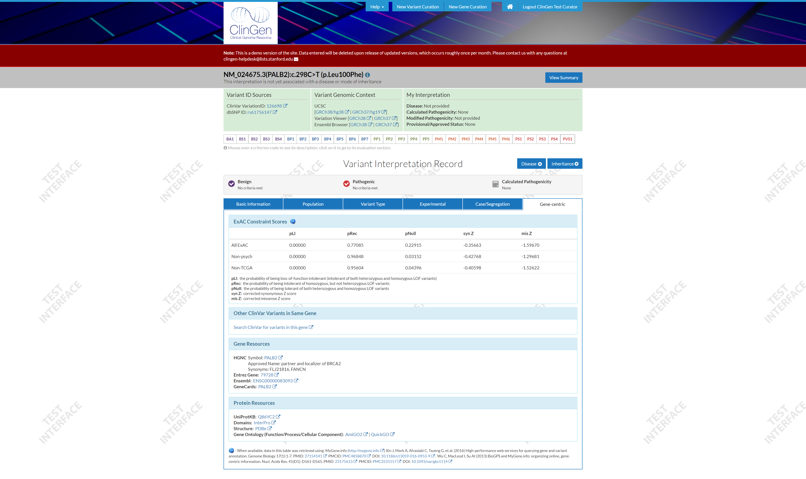

# Purpose

- Play with newer React concepts like Context.
  - Hooks doesn't make sense for this experiment.
- Play with various UI React components that Ihaven't had a chance to utilize during my full-time job.
  - `react-aria-tabpanel` for the tabs.
    - Chosen for it's accessibility features.
      - Select a tab, use you left/right arrow keys to switch tabs.
  - `react-awesome-popover` for the popover hover copy.
    - Chosen because it allowed me to style everythign quickly.
  - `react-css-grid` for the multi column layouts.
    - Chosen because I haven't had an opportunity to use CSS Grid yet.

## Inspiration:

## Available Scripts

In the project directory, you can run:

### `npm run dev`

Runs the app in the development mode. 
Open [http://localhost:3000](http://localhost:3000) to view it in the browser.

The page will reload if you make edits. 
You will also see any lint errors in the console.
The React Devtools will open.

### `npm run start`

Same as above, but without the React Devtools opening.
